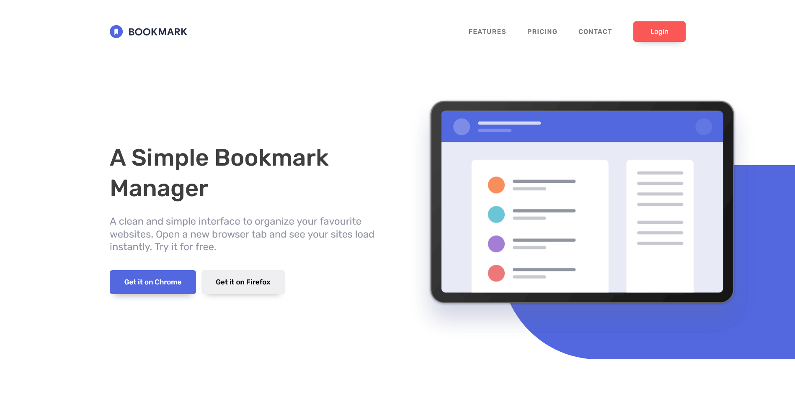

# Frontend Mentor - Bookmark landing page solution

This is a solution to the [Bookmark landing page challenge on Frontend Mentor](https://www.frontendmentor.io/challenges/bookmark-landing-page-5d0b588a9edda32581d29158). Frontend Mentor challenges help you improve your coding skills by building realistic projects.

## Table of contents

- [Overview](#overview)
  - [The challenge](#the-challenge)
  - [Screenshot](#screenshot)
  - [Links](#links)
- [My process](#my-process)
  - [Built with](#built-with)
  - [What I learned](#what-i-learned)
  - [Useful resources](#useful-resources)
- [Author](#author)

## Overview

### The challenge

Users should be able to:

- View the optimal layout for the site depending on their device's screen size
- See hover states for all interactive elements on the page
- Receive an error message when the newsletter form is submitted if:
  - The input field is empty
  - The email address is not formatted correctly

### Screenshot

### Links

- Solution URL: [Click Here 🚀](https://github.com/ubed90/bookmark-landing-page)
- Live Site URL: [Click Here 🚀](https://ubed90.github.io/bookmark-landing-page/)

## My process

### Built with

- Semantic HTML5 markup
- CSS custom properties
- Flexbox
- CSS Grid
- Mobile-first workflow
- [Angular](https://angular.io/)

### What I learned

Learned to implement Single Page Applications in Popular JavaScript Framework Angular. Explored the power and Possibilities of Angular.

### Useful resources

- [Angular Documentation](https://angular.io/) - This helped me for Implementing Angular.

## Author

- Website - [Ubed Shaikh](https://github.com/ubed90)
- Frontend Mentor - [UbedS](https://www.frontendmentor.io/profile/ubed90)
